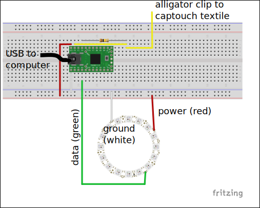

# A basic intro to capacitive touch sensors

Using some simple circuits, freely available arduino libraries, and a touch sensor that can be made out of readily available materials like tinfoil or even specially treated textiles, you can make a _capacitive touch sensor_ to integrate into interactive art and costuming projects. In this tutorial, we'll set up a simple circuit to accomplish this along with the basic theory on how this works, and set up a teensy microcontroller to generate a series of different effects on an LED strip based on user interactions with the touch sensor.

## Setting up the circuit

### Supplies

For this circuit, you'll need:

 - A teensy 2 (many, many microcontollers will work just as well, but these instructions are written for the teensy 2).
 - a 100 kOhm resistor
 - a capacitive touch sensing foil, like a piece of textile teated with pyrrole, or even just a piece of tinfoil
 - a ring of 16 neopixels (this is just for an example output; you can hook anything you want up to your capacitive touch sensing circuit).
 - a bunch of jumper wires
 - two double-sided alligator clips
 - 0.1 pitch male-male header pins if they aren't already
 - a USB cable with the right connections to connect your teensy to your laptop

### Prep

Solder your header pins to your teensy, and some stripped leads to your neopixel ring. Your instructor might have already done this for you!

### Circuit construction

Set up your circuit as follows:

